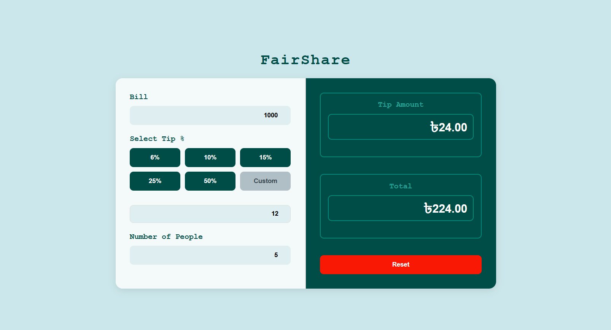

# BillSplitter

## 📌 Introduction

**BillSplitter** is a simple and user-friendly web application designed to help you split bills effortlessly with your friends or colleagues. Whether you're dining at a restaurant, having drinks at a bar, or sharing expenses during a trip, this app ensures fair cost distribution. No more manual calculations or confusion—just enter the bill details, and let BillSplitter handle the rest! 

## 🚀 Features

✅ **Quick and Accurate Calculations** – Get precise results instantly.  
✅ **Custom Splitting Options** – Adjust shares for each person individually.  
✅ **Tax & Tip Inclusion** – Automatically factors in tax and tips.  
✅ **Intuitive User Interface** – Designed for ease of use.  
✅ **Mobile Responsive** – Works smoothly on both desktop and mobile devices.  
✅ **No Login Required** – Simple, direct, and hassle-free usage.  

## 🛠 Technologies Used

BillSplitter is built using the following web technologies:

- **HTML** – Structuring the web interface.
- **CSS** – Styling to create an appealing UI.
- **JavaScript** – Logic for calculations and dynamic updates.

## 🎯 How to Use

1. **Enter the Total Bill Amount** – Input the full amount of the bill.
2. **Specify the Number of People** – Enter the number of people sharing the bill.
3. **(Optional) Adjust Custom Splits** – Modify individual shares if needed.
4. **Include Tax & Tip** – Add a percentage for tax and tip (if applicable).
5. **Click the "Calculate" Button** – Get a detailed breakdown of how much each person owes.
6. **View and Share** – Easily share the results with your friends!

## 📸 Screenshots

## 💡 Future Enhancements

- ✅ **Bill History Feature** – Save and retrieve past bill splits.  
- ✅ **Currency Conversion** – Allow users to choose their preferred currency.  
- ✅ **Dark Mode** – Add a toggle for dark mode.  
- ✅ **Share via QR Code** – Generate QR codes to easily share calculations.  
- ✅ **Expense Categories** – Categorize bills into food, transport, shopping, etc.

## 🤝 Contributing

We welcome contributions! If you’d like to improve the app, follow these steps:

1. **Fork the repository** on GitHub.
2. **Create a new branch** for your feature/fix.
3. **Commit your changes** with clear messages.
4. **Push the branch** to your forked repo.
5. **Submit a pull request** for review.

---

Enjoy seamless bill splitting with **BillSplitter**! 🎉
